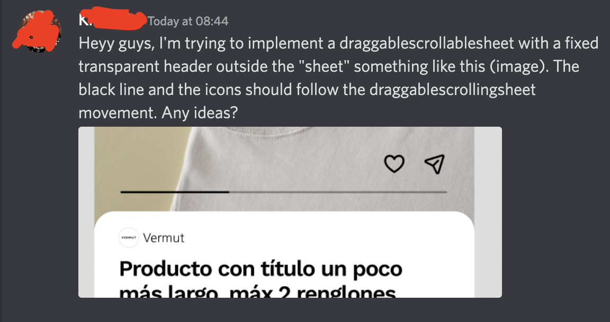

# Draggable Scrollable Sheet with a Fixed Transparent Header

🚀 Made with Flutter.

🤩 Easily editable

🐦 Follow me on Twitter for more Flutter tips and tutorials! [CodingMario](https://twitter.com/mariopepe_)

## The reason

A discord user (of the r/FLutterDev channel) asked to have "draggablescrollablesheet with a fixed transparent header".

This is my version:

## Need me to fix something?

Reach out to me on Twitter with the requested modifications and I will do my best!