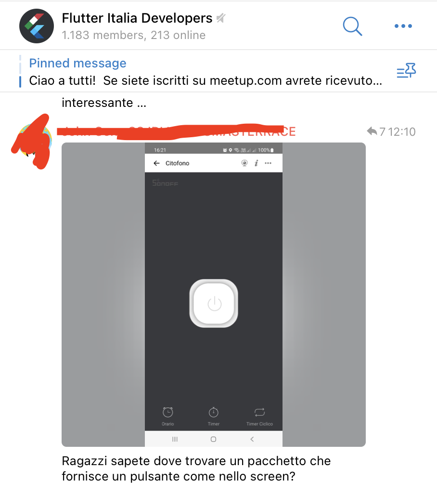

# TikTok Record Button Animation

🚀 Made with Flutter.

🤩 Easily editable (insert inside of SizedBox to edit the size)

🐦 Follow me on Twitter for more FLutter tips and tutorials! [CodingMario](https://twitter.com/mariopepe_)

## The reason

A Telegram user (of the Flutter Italia Developers) asked to have a power button button made in FLutter.

This is the sample image I have been given:

This is my version:

## Need me to fix something?

Reach out to me on Twitter with the requested modifications and I will do my best!