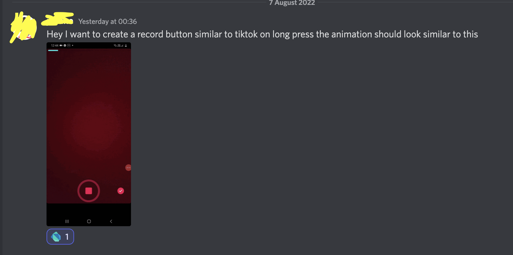
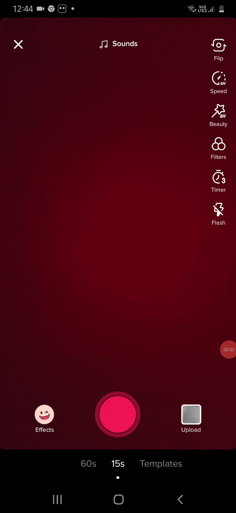
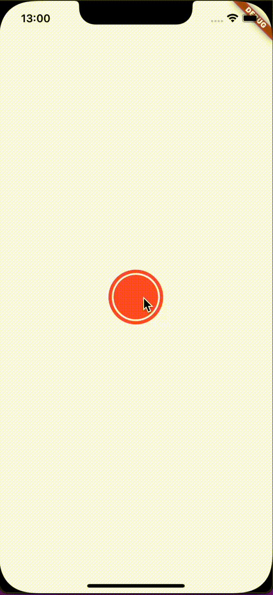
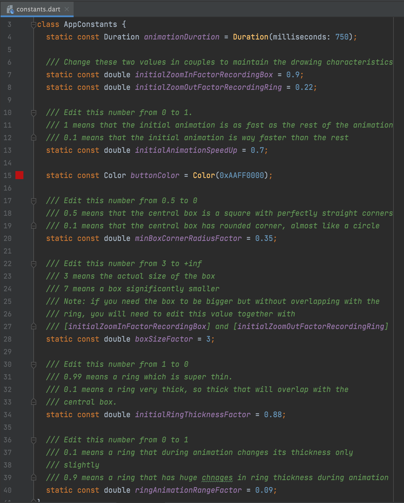

# TikTok Record Button Animation

🚀 Made with Flutter.

🤩 Easily editable

🐦 Follow me on Twitter for more FLutter tips and tutorials! [CodingMario](https://twitter.com/mariopepe_)

## The reason

A discord user (of the r/FLutterDev channel) asked to have a record button made in FLutter similar to the TIkTok one.

This is the sample gif I have been given:

This is my version:

## Easily editable

Go to the `lib/common/constants.dart` file to edit every aspect of the animations and the drawings.

If you are looking for even more advanced editing capabilities go to `lib/recording_button/custom_paint` to edit the proportion of the drawing.

## Need me to fix something?

Reach out to me on Twitter with the requested modifications and I will do my best!